# NitrogenGenerator

## Motivation

As a home brewer CO2 is the gas of choice for most purposes, including pushing beverages to the tap. But sometimes you don't want to just serve beer but also coldbrew coffee and other non-carbonated beverages. In most cases a simple N2 cylinder does the job. But given that air is 78% nitrogen why not just extract it from the air? Recently products like NitroBev 360 have introduced this possibility on a small scale, at a price. Given the huge margins these niche products have my thought was to try to build a nitrogen generator from scratch for less.

## How nitrogen generators work

We will be talking about membrane based systems here only. A membrane-based nitrogen generator works by passing compressed air through a semi-permeable membrane made of bundles of hollow polymer fibers. Oxygen and water vapor molecules, being smaller and having a higher permeation rate, pass through the membrane walls and are vented out. Nitrogen molecules, being larger and having a lower permeation rate, are retained within the fibers and collected as a high-purity nitrogen gas stream at the outlet. Purity levels can be adjusted down to about 0.5% oxygen which is appropriate for beverage service.

A membrane nitrogen generator requires a minimum amount of continuous compressed air to function effectively because the separation process relies on a consistent flow of air across the semi-permeable membranes. This continuous flow maintains the pressure differential needed for the selective permeation of oxygen and water vapor, allowing the nitrogen to be concentrated and collected. If the air supply is insufficient or intermittent, the pressure will drop, reducing the efficiency of the separation process and potentially leading to lower nitrogen purity and flow rates. Furthermore, the design of the membranes and the entire system is optimized for a specific range of air flow rates; operating below this minimum can disrupt the intended gas dynamics and performance of the generator.

A critical component of a nitrogen generator is a needle valve which is placed post nitrogen membrane. This needle valve controls the resulting nitrogen purity. Too high air flow at the membrane output will result in high oxygen levels or no oxygen filtering at all. Too low and most of the compressed air input is lost in the permeate and the effiency of the system drops off a cliff. This adjustment is highly dependent on the type and size of membrane used and drive the required continious compressed air requirement.

A nitrogen generator requires filtered air to protect its delicate internal components, primarily the semi-permeable membranes. Compressed air invariably contains contaminants like dust particles, oil aerosols, water vapor, and hydrocarbons. These contaminants can foul or block the tiny pores within the membranes of membrane-based generators, reducing their efficiency and drastically reduce lifespan, from years down to a few hours. Typically any contaminants down to 0.01μm need to be filtered out of the air before it enters the membrane.

## Scope and scale

Typically a home brewer will not need that much nitrogen. Most commerical large scale nitrogen generation equipment is built for continious N2 blanketing and is optimized for that use case. We need to carefully consider what our goals are:

- optimize for low power use
- optimize for casual use
- idle time should not consume any power
- using readily available and servicable components
- easy maintainablity overall
- reasonanble N2 output for the application
- portability of the equipment
- making use of equipment home brewers have already 

Resulting technical metrics for my application:

- regular 120V/240V power so we can use household power or a generator.
- ~50l/h (2cfh) output. That equates to about one keg per hour.
- Max 30l/h (1cfm) of compressed air requirement so we can use a small quiet portable compressor.
- Max system pressure of about 100psi. That way we can use a Cornelious keg as a holding tank. 

## Skills required

- Some experience with actively pressure controlled vessels is required. Home brewers using kegs usually have this knowledge.
- Experience with PLCs or building you own PCB / Arduino to control the air system. Some programming is required.
- General knowledge on compressed air tubing, pipe fittings, air connectors, NPT fittings and 8mm push-in fittings. 
- General knowledge on how sensors and solenoids work and how they are wired up. 
- General knowledge of electrical and air equipment.

## Selecting the components

### Summary

1. nitrogen membrane
2. air filter
3. air compressor
4. oxygen sensor
5. holding tank
6. controller 
7. 2 x solenoid
8. 2 x needle valve
9. 2 x pressure inducer
10. misc connector, fittings, tubing, cables
11. enclosure

### Details

1. The core part of this build is the nitrogen membrane. For a 50l/h (2cfh) nitrogen flow the nitrogen membrane will be typically in a form a cylinder in the range of 300-500mm (12-15in) in length and 40-60mm (1.5-2.5in) in diameter. \
\
Consult the [spec](./docs/MNH-1512A.pdf) pages of the membranes which usually contain tables explaining the required air input vs resulting nitrogen output at different concentrations. For practical purposes I would simply ignore any nitrogen concentration under 99.5%. Typical air input vs concentrated nitrogen air output ratios are 5:1. Focus on models which are in the 50l/h (2cfh) range at 100psi and 99.5%+ nitrogen concentation. \
\
Nitrogen membranes have a maximum input pressure design limit. This can range from 80psi to 150psi or higher for special applications. Above that the membrane might disintegrate internally. Get a variant rated to around 120psi or higher as we targeting 100psi as the system pressure. \
\
Membranes have a 'knocking' limit, i.e. maximum pressure differential going into the system when suddendly opening a valve. This is usually 20-50psi. A too high pressure differential can shatter the membrane, completely destroying it. We will control this through a needle valve on the input side. Most commerical equiment will omit this valve since those systems are usually in a well controlled environment. I assume the user (me) will make a stupid mistake at some point and I'd rather protect the expensive membrane. \
\
Given local prices for nitrogen membranes, which can be in the many thousands of dollars, I sourced my membrane from Alibaba.com. Specifically the [MNH-1512A](./docs/MNH-1512A.pdf) model from KL-AIR. At the time of this writing it was $400, not including shipping and tariffs. I got two, which set me back $1000 in total including shipping. \
\
Be careful when looking on eBay for used membranes. There will be a good chance that those membranes are clogged/used-up. No eBay seller will be able to test if a membrane still works properly. Also, don't make the same mistake I made where I got a nifty (almost free) deal on a membrane only to realize that it needs 170l/m (6cfm) to drive it. That's a LOT of air for a home gamer!

[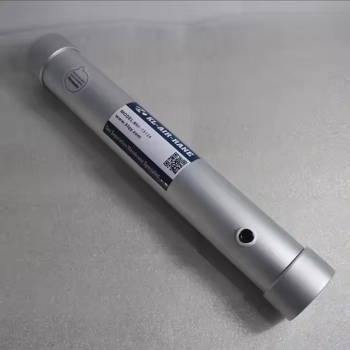](./images/membrane.jpeg)

2. We need a 3-stage air filter to treat the air. The stages are usually a 1μm particulate filter, a 0.1μm oil filter and a 0.01μm coalescing filter. There are many variations on that but the key is that we want a 0.01μm stage in there somewhere. If yor air contains a lot of hydrocarbons (like in an active workshop) you'd also want an activated charcoal filter in addition to the 3-stage filter. Prices range from $200 to $2000 (if you get one on McMaster). I chose a PneumaticPlus SAFU460-N04-MEP which seemed reasonbly priced at $200. Do NOT skimp on this important component! Nitrogen membranes can last for years, improperly filtered air can reduce that to mere hours! We are talking atomic level membrane filters here.

[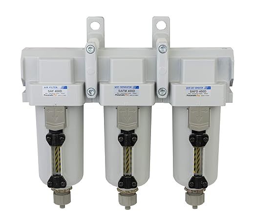](./images/airfilter.jpg)

3. Most commerically available air compressors can easily provide the air required for this membrane. I chose a Makita MAC100Q. It's small and quiet. About $250.

[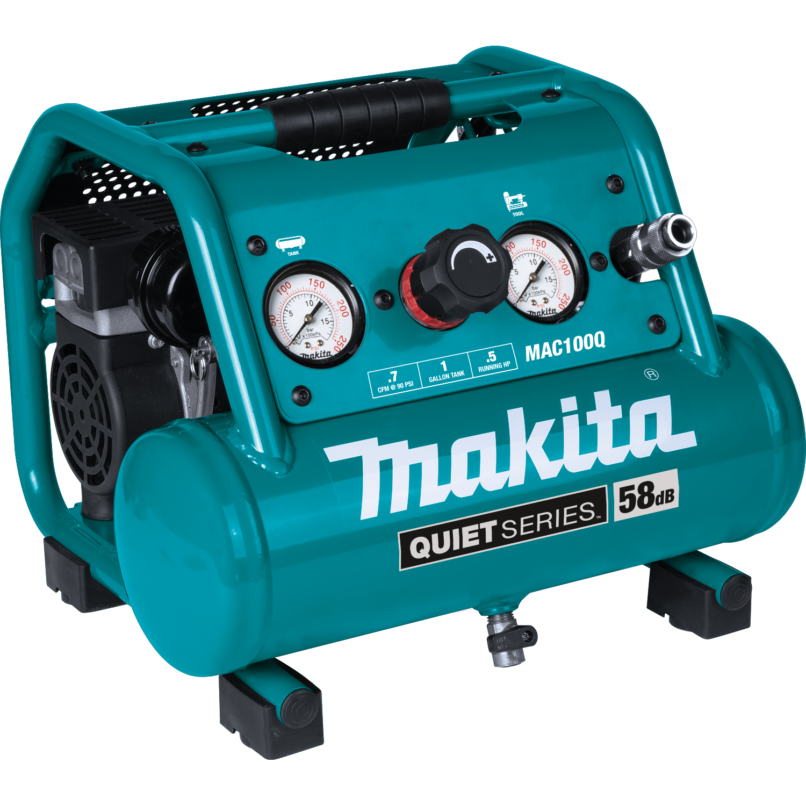](./images/compressor.png)

4. You will need an oxygen sensor. Otherwise you have no idea what the final oxygen concentration is. It's practically impossible to adjust the output needle valve without this! A scuba diving rated oxygen sensor which can detect 0%-30% oxygen concentration will work fine, on Amazon I picked a "OXYGEN Analyzer by FORENSICS" for $200. Make sure that you can attach a tube and pass air through it. Cheap oxygen sensors can only sense environmental air.

[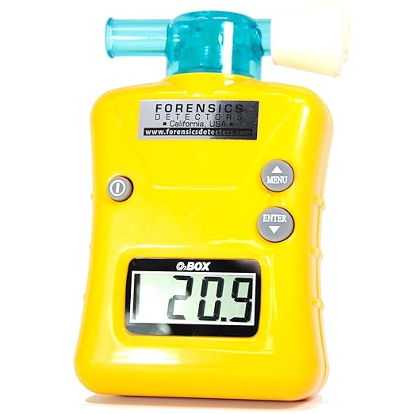](./images/oxygensensor.jpg)

5. A holding tank for the nitrogen. A 5 gallon Cornelious will do, $130.

[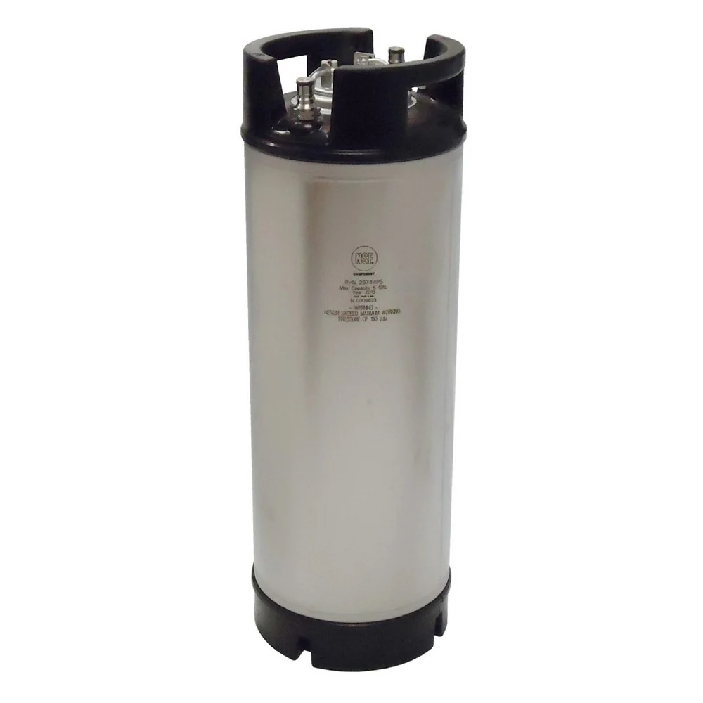](./images/corneliouskeg.jpeg)

6. We need a controller to sense the air pressures and drive the solenoids. My initial prototype accomplished this with a Click PLC from Automation Direct. It's rather bulky, requires ladder logic knowledge and a complete system comes to about $300. For my final product I built my own custom PCB which is way more compact. The DigiKey BOM for this about $130, 5 prototype PCBs from PCBWay cost $50 including shipping. I added an LCD screen for status display as a bonus. Apart from a PLC or custom PCB, a hacked together Arduino project will also work.

[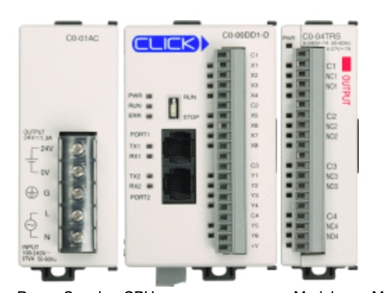](./images/plc.jpg)
[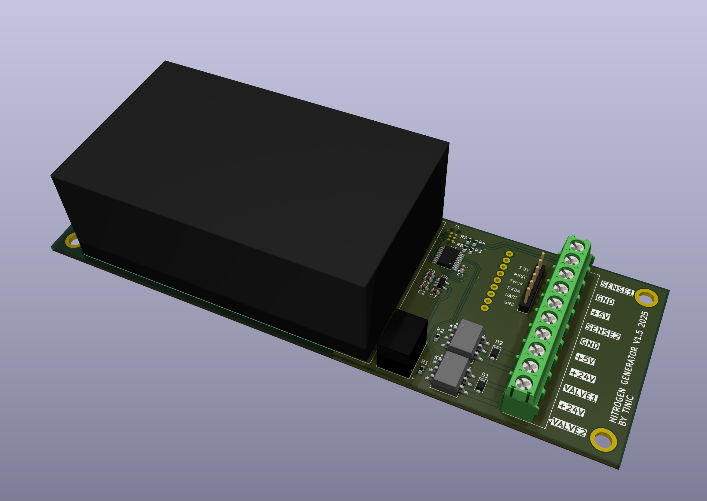](./images/pcb1.jpg)
[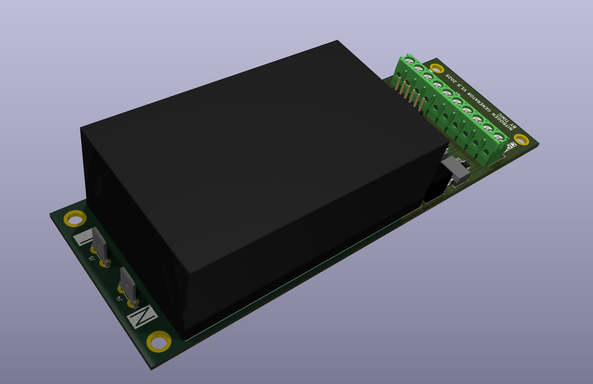](./images/pcb2.jpg)

7. To control the air throughout the system we need two needle valves and two solenoids (normally closed, 24V). The exact specs depend on how you want to build up the system. I chose I mix of 1/4 NPT and 8mm push in tubing equipment. It's possible to go all the way into either. I went for some Amazon specials: 1. "stainless steel needle valve, 3mm orifice, 1/4" NPT, SURUIKE INDUSTRY" and "Solenoid Valve AirTAC 2WA030-08 1/4 NPT DC24V". Total was about $120 for these. 

[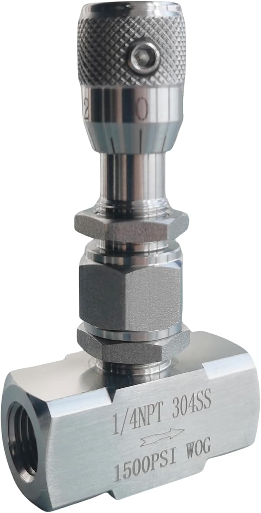](./images/needlevalve.jpg)
[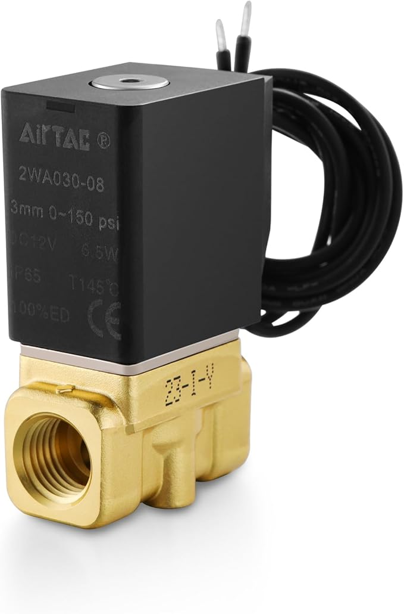](./images/solenoid.jpg)

9. Two pressure inducers (pressure sensors) 0-200psi. On Amazon "AUTEX 200 Psi Pressure Transducer Sender Sensor with Connector Harness 1/8”-27 NPT". $52 total.

[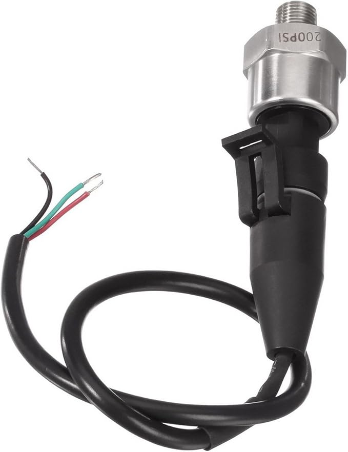](./images/pressureinducer.jpg)

10. Various other equipment like connectors, fittings, tubing, fasteners etc. They will amount to about $200. Most of the stuff can be had the regular hardware store and it's not useful to list a specific BOM for this as it will depend on your setup/enclosure.

11. For extra bonus I designed a stainless steel enclosure as this equipment will be traveling. Laser cutting and bending was done by OshCut. $380 including shipping using way to thick 17 gauge (1.9mm) stainless steel. Powder coated steel and thinner material could reduce this to about half. Or just build your own enclosure from whatever material you have, maybe 3d printed.

Total cost (assuming one membrane) was $2222. That's still only about half the price of a commerical solution!

## System Design

### P&ID alike schematic which shows the how the air goes through the system:

[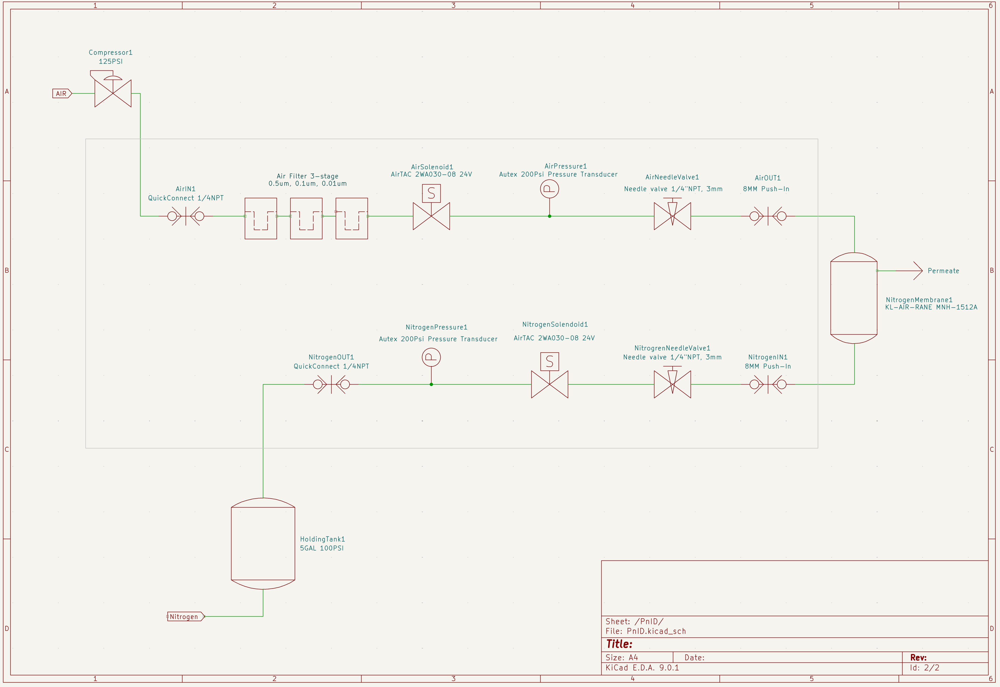](./images/airschematic.png)

### Solenoid driving logic

The solenoids are used to control how the air enters and nitrogen exits the system. The following logic is used by the controller:

1. When pressure on the holding tank side / output side (NitrogenPressure1) drops below 75psi open the solenoid on the input side (AirSolenoid1) to start filtering process.
2. Hold the output solenoid (NitrogenSolenoid1) closed until the pressure of the filtering section (AirPressure1) reaches 75psi. This makes sure that we have maximum nitrogen concentration before nitrogen goes into the holding tank.
3. When the holding tank side / output side reaches 100psi (NitrogenPressure1) close both solenoids and go back to step 1.

Some timers (5-10s) are used to stagger the activation of the solenoids (hysteresis) to avoid ocillations and feedback loops.

Additionally the controller will monitor the following conditions:

- If the input pressure (AirPressure1) drops below 75psi at any point, both solenoids always stay closed. This is to prevent backfeeding and nitrogen loss in the holding tank.
- If the input pressure (AirPressure1) increases beyond 120psi at any point, both solendoids stay closed. To high of pressure can destroy the membrane.
- If the input and output pressures are out of range (<0 or >150psi) (AirPressure1 and NitrogenPressure1), both solendoids stay closed. This could happen when one of the pressure sensors fail.

### Procedure to adjust input and output needle valves

#### Preparation

1. The input needle valve should be adjusted so that suddendly feeding 100psi through it does not cause a "loud bang". Rather it should feel like 5-10 psi coming out of a compressor. Rig something up and adjust that valve before you put the entire system together.
2. To test the entire system for leaks initially set the output needle valve to fully closed.

#### Final procedure

3. When you are done checking for leaks and to avoid destroying the oxygen sensor open the output valve by only 4 turns or so. 
4. Attach the oxygen sensor directly to the output using tubing and zero air gaps and start closing the needle valve slowly until you see the oxygen dropping. 
5. Very slowly and patiently continue to close the valve until you reach <=1% oxygen. It can take some time for the oxygen to flush out. Do not be surprised by how little pure nitrogen comes out when you reach <=1%. 
6. Stop right there. Closing it more will cause the permate air to nitrogen air ratio to go above the ideal, i.e. much higher than 5:1 and will not improve nitrogen concentration further. 
7. Remember that we only get 50l/h(2cfh) with this membrane, it's normal to just barely feel air coming out! Use your lips to determine if any air is coming out.
