# Nitrogen Generator for Home Brewing

> DIY membrane nitrogen generator for **nitro cold brew coffee**, **nitro stout**, and beverage push-gas service. Extracts **99.5%+ pure N₂** from compressed air. Total build cost **$2,222** — about half the price of commercial alternatives like NitroBev 360 or NitroBrew.

[](./images/final_inside.jpg)
[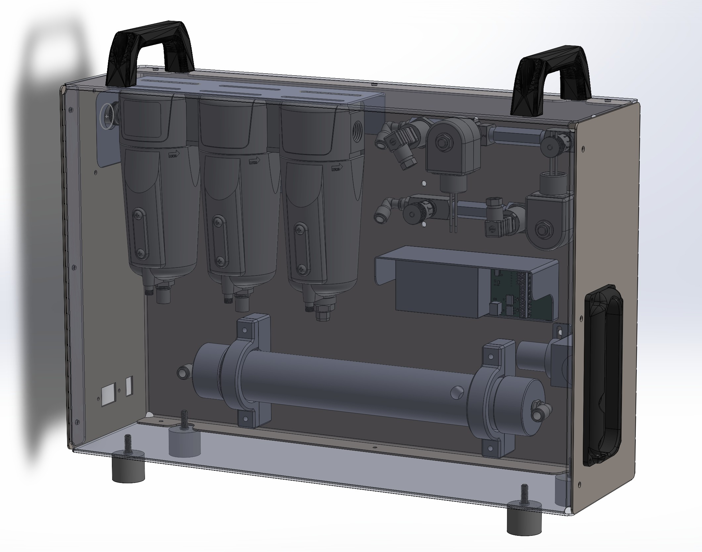](./images/solidworks.jpg)
[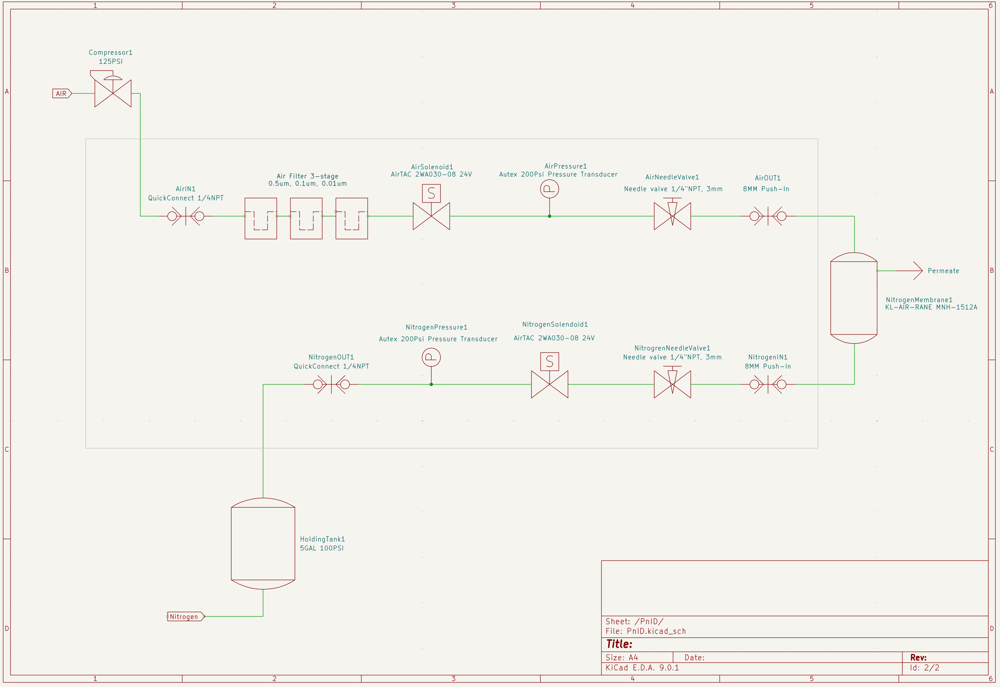](./images/airschematic.png)

## At a glance

| Spec | Value |
|---|---|
| Output flow | 50 L/h (2 CFH) at 100 PSI |
| Output purity | 99.5%+ nitrogen (≤0.5% O₂) |
| Compressed-air input | ≤ 30 L/h (1 CFM) |
| Operating pressure | 75–100 PSI |
| Air-to-N₂ ratio | ~5:1 |
| Power | 120/240 V AC (idle = 0 W; runs only when refilling) |
| Membrane | KL-AIR MNH-1512A |
| Holding tank | 5 gal Cornelius keg |
| Total cost | **$2,222** |

### Cost vs. commercial alternatives

| Option | Cost |
|---|---|
| **This DIY build** | **$2,222** |
| NitroBev 360 | ~$4,500 |
| Industrial PSA nitrogen generator | $8,000+ |

## Motivation

As a home brewer CO₂ is the gas of choice for most purposes, including pushing beverages to the tap. But sometimes you don't want to just serve beer but also cold brew coffee and other non-carbonated beverages. In most cases a simple N₂ cylinder does the job — but given that air is 78% nitrogen, why not just extract it from the air? Recently products like NitroBev 360 have introduced this possibility on a small scale, at a price. Given the huge margins these niche products have to have, my thought was to build a nitrogen generator from scratch for less.

**Use cases this build is sized for:**

- Nitro cold brew coffee on draft
- Nitro stout / Guinness-style cascading head
- Wine and whiskey blanketing during long pours
- Generic beverage push gas where CO₂ would over-carbonate

## How nitrogen generators work

This project uses **membrane separation**. A membrane-based nitrogen generator works by passing compressed air through a semi-permeable membrane made of bundles of hollow polymer fibers. Oxygen and water vapor molecules, being smaller and having a higher permeation rate, pass through the membrane walls and are vented out as permeate. Nitrogen molecules, being larger and slower to permeate, remain inside the fibers and exit at the outlet as a high-purity nitrogen stream. Purity is adjustable down to about 0.5% residual oxygen — well within spec for beverage service.

A membrane generator needs **continuous compressed-air flow** to work. The separation relies on a sustained pressure differential across the fiber walls; if the air supply is intermittent or undersized, the differential collapses and oxygen leaks straight through. The membrane is also engineered for a specific air-flow band — undershoot it and the gas dynamics break down well before you're starving on volume.

A small **needle valve on the membrane output** controls purity. Open it too far and the residence time inside the fiber drops, producing high-O₂ output. Close it too far and most of your compressed air is dumped overboard as permeate, killing efficiency. This adjustment is per-membrane and is the single most important calibration step in the build.

The membrane needs **clean air**. Compressed air carries dust, oil aerosols, water vapor, and hydrocarbons; any of those will foul the polymer fibers. Without proper filtration, a membrane that should last *years* will die in *hours*. We filter down to **0.01 µm** before the air sees the membrane.

### Membrane vs. PSA — why membrane

PSA (Pressure Swing Adsorption) generators reach higher purity (down to a few ppm O₂) but use molecular-sieve beds, twin-tower switching valves, and large compressors — overkill for home use, expensive, and noisy. Membrane is the right scale here: no moving parts, low power, scales down to 50 L/h cleanly, and 99.5% purity is more than enough for beverage service.

## Goals & target metrics

Most commercial large-scale nitrogen equipment is built for continuous N₂ blanketing. We don't need that — a home brewer fills a keg now and then. The design priorities:

- Optimize for **low power** and **casual use**
- **Idle = zero power** (the system only runs when nitrogen is being made)
- Use **readily available, serviceable** components
- **Reasonable N₂ output** for the application — one keg per hour is plenty
- **Portable** — fits in a stainless enclosure, plugs into 120 V
- Reuse equipment home brewers already have (Cornelius keg as accumulator)

Resulting numbers:

- **120/240 V household power** — works on a generator too
- **~50 L/h (2 CFH)** N₂ output — about one keg per hour
- **≤30 L/h (1 CFM)** compressed-air input — small quiet portable compressor is fine
- **100 PSI max** system pressure — Cornelius keg territory

## Skills required

- Hands-on experience with pressurized vessels (kegging-pressure literacy is enough)
- Programming a PLC, Arduino, or microcontroller — the controller is custom firmware here, but ladder logic is fine too
- Comfort with NPT and 8 mm push-in pneumatic fittings, basic leak chasing
- Reading a P&ID
- Multimeter and soldering iron at the level of "I've put together a kit before"

## Bill of materials

These are the actual parts I bought, with what I paid. Substitutes are fine where noted; the membrane and the air filter are the two parts you should not cheap out on.

| # | Component | Model / part | Source | Paid | Notes |
|---|---|---|---|---|---|
| 1 | Nitrogen membrane | [MNH-1512A](./docs/MNH-1512A.pdf) | KL-AIR (Alibaba) | $400 | 50 L/h @ 100 PSI, 99.5%; 120 PSI max input |
| 2 | 3-stage air filter | PneumaticPlus SAFU460-N04-MEP | Amazon | $200 | 0.01 µm coalescing final stage — **don't skimp** |
| 3 | Air compressor | Makita MAC100Q | Hardware store | $250 | Quiet, ~1 CFM, oil-free |
| 4 | O₂ analyzer | FORENSICS O₂ Analyzer | Amazon | $200 | 0–30%, must support flow-through (tube fitting) |
| 5 | Holding tank | 5 gal Cornelius keg | Homebrew supplier | $130 | |
| 6 | Controller | Custom STM32G030 PCB | DigiKey + PCBWay | $130 | $80 BOM + $50 for 5 prototype boards. Click PLC works too (~$300) |
| 7 | Solenoid valves (×2) | AirTAC 2WA030-08 | Amazon | $80 | 24 V DC, normally closed, 1/4″ NPT, Viton seals |
| 8 | Needle valves (×2) | SURUIKE INDUSTRY 3 mm orifice | Amazon | $40 | Stainless, 1/4″ NPT |
| 9 | Pressure transducers (×2) | AUTEX 0–200 PSI | Amazon | $52 | 1/8″-27 NPT, with connector harness |
| 10 | Check valve | Low-cracking-pressure (<2 PSI) | Hardware store | $15 | |
| 11 | Fittings, tubing, cable | Mixed NPT + 8 mm push-in | Hardware store | ~$200 | |
| 12 | Enclosure | Stainless steel, laser-cut + bent | OshCut | $380 | 17-gauge (1.9 mm) — overkill, powder-coated steel halves the price |
| | | | **Total** | **$2,222** | |

[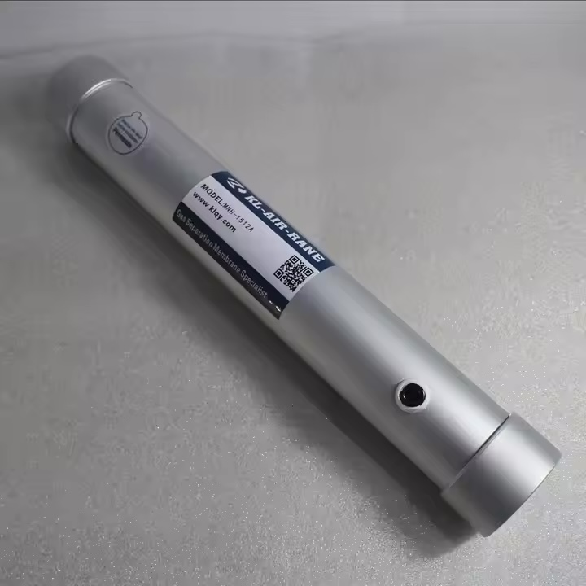](./images/membrane.jpeg)
[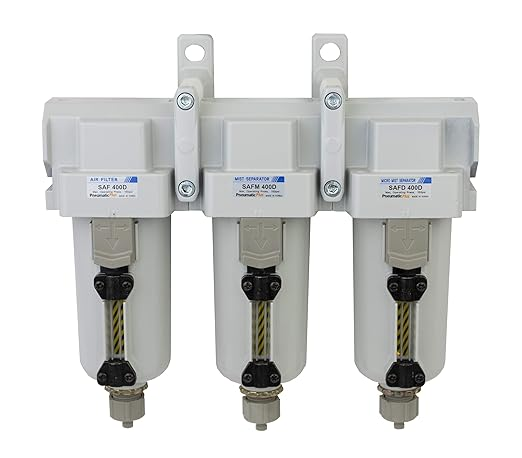](./images/airfilter.jpg)
[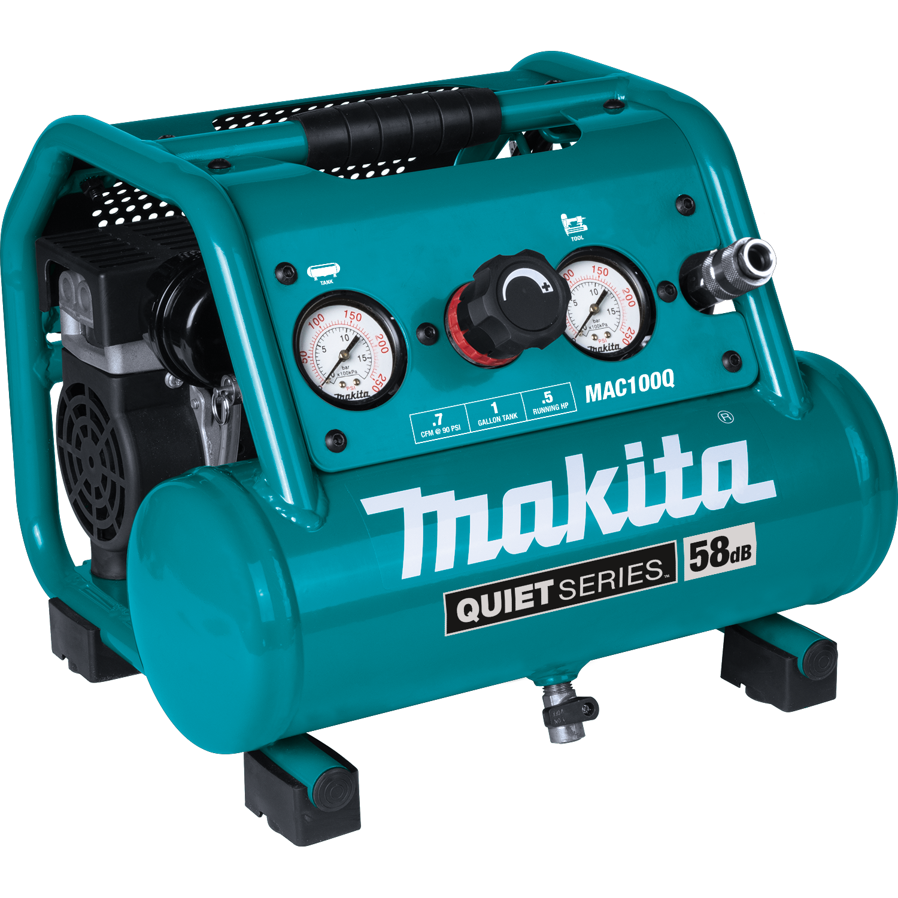](./images/compressor.png)
[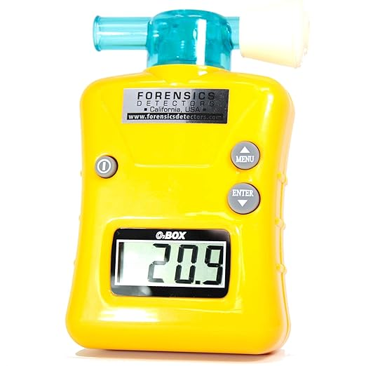](./images/oxygensensor.jpg)
[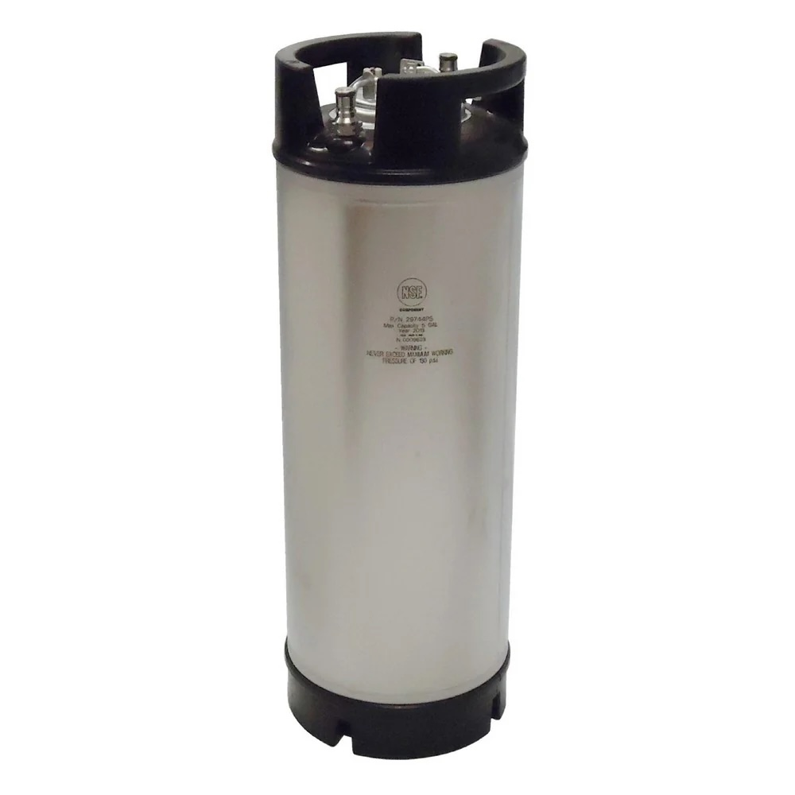](./images/corneliouskeg.jpeg)
[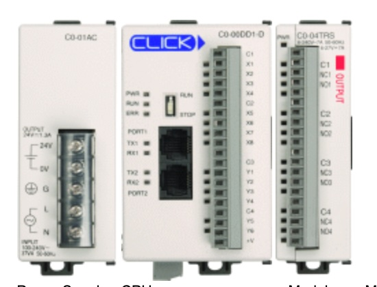](./images/plc.jpg)
[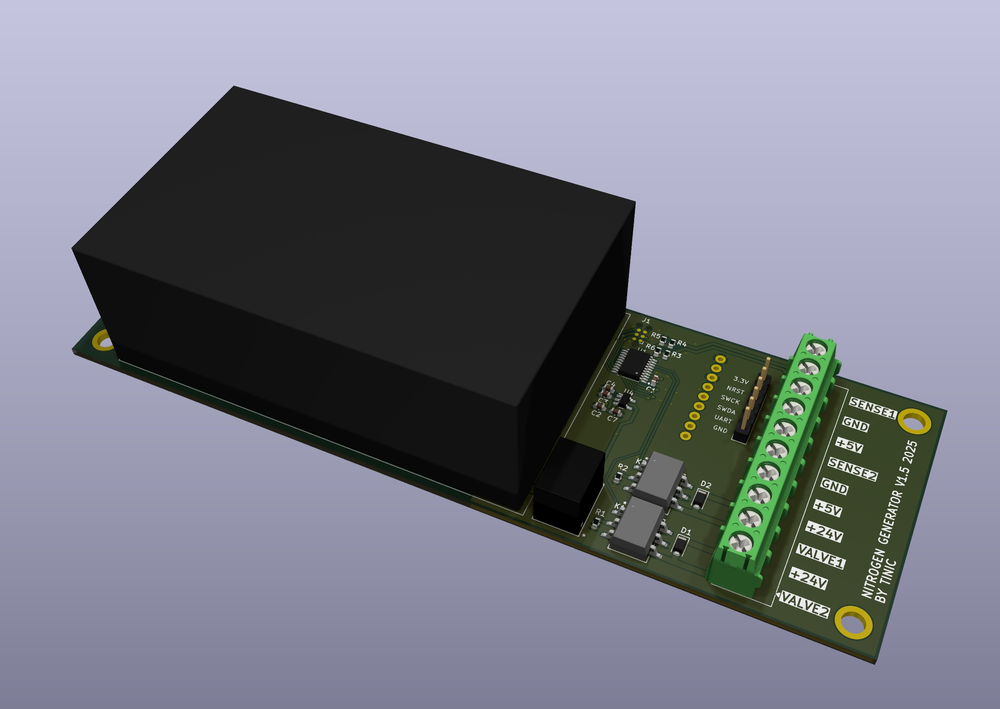](./images/pcb1.jpg)
[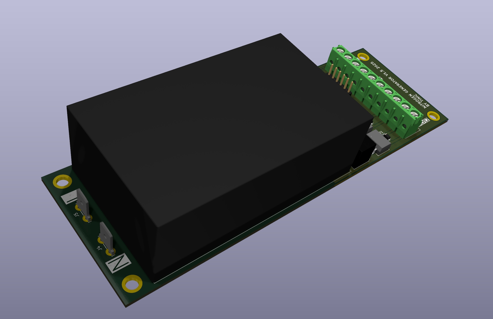](./images/pcb2.jpg)
[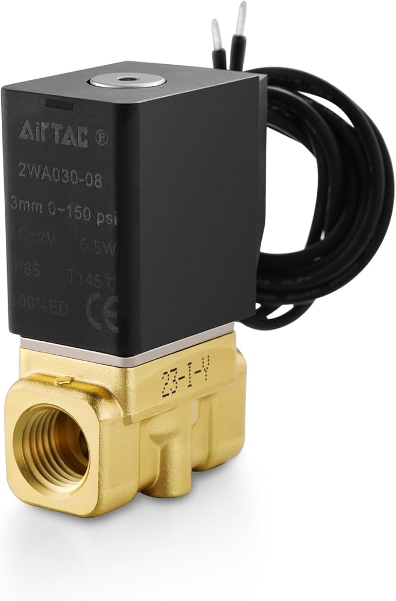](./images/solenoid.jpg)
[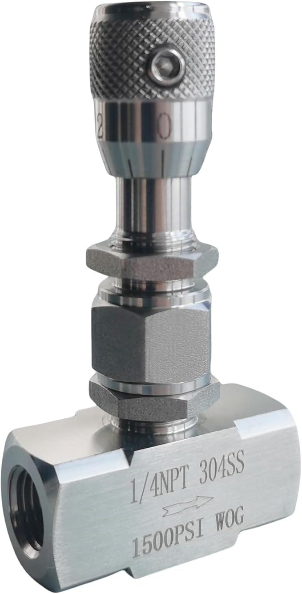](./images/needlevalve.jpg)
[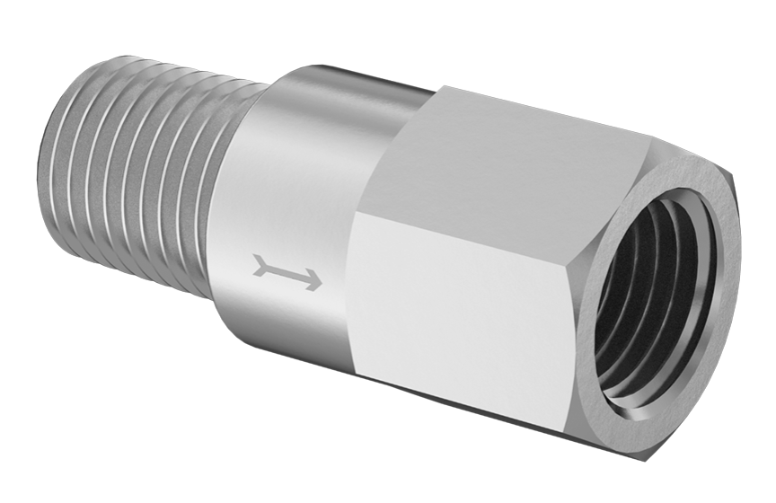](./images/checkvalve.png)
[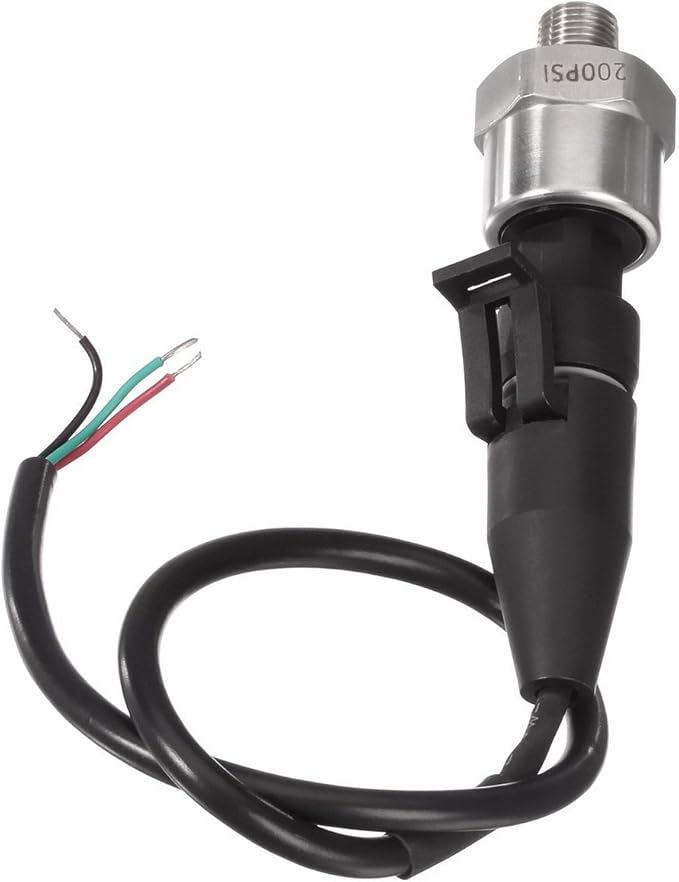](./images/pressureinducer.jpg)

### Don't buy these mistakes

- **Used eBay membranes.** No seller can verify the polymer fibers haven't been clogged with oil or particulates. A fouled membrane looks fine but won't separate. Spend the $400 new.
- **Oversized membranes.** I once snagged an "almost free" deal on a membrane that turned out to need **170 L/min (6 CFM)** of input air. That's an industrial compressor. Read the datasheet's input-flow column before you click buy.
- **Harbor Freight 5 µm filters.** Membrane manufacturers spec **0.01 µm** for a reason. A coarse filter will reduce your membrane lifetime from years to hours. Don't.

## System design

### Pneumatic schematic

[](./images/airschematic.png)

The KiCad source for the P&ID lives at [`PnID.kicad_sch`](./PnID.kicad_sch).

### Control logic — solenoid sequence

The two solenoids (input air, output nitrogen) gate when air enters the membrane and when nitrogen leaves it. The controller runs this loop:

1. When **NitrogenPressure1** (holding-tank side) drops below **75 PSI**, open **AirSolenoid1** (input) to start filtering.
2. Hold **NitrogenSolenoid1** (output) closed until **AirPressure1** (membrane side) reaches **75 PSI**. This guarantees the membrane is at full operating pressure before any gas hits the keg, so the first nitrogen is at full purity.
3. When **NitrogenPressure1** reaches **100 PSI**, close both solenoids and return to step 1.

Short hysteresis timers (5–10 s) stagger the solenoid transitions to avoid oscillation around the setpoint.

### Safety interlocks

The controller continuously enforces:

- **AirPressure1 < 75 PSI at any point** → both solenoids closed. Prevents back-feed and nitrogen loss from the keg.
- **AirPressure1 > 120 PSI at any point** → both solenoids closed. The membrane's mechanical limit; exceed it and the fibers can shatter.
- **Either pressure < 0 or > 150 PSI** (out of physical range) → both solenoids closed. Fail-safe for sensor failure.

### What the firmware does on every tick

The state machine in [`CubeMX/mcp.cpp`](./CubeMX/mcp.cpp) (function `Slice()`) reduces to:

```
read AirPressure1, NitrogenPressure1
if any sensor out of range:           goto FAULT
if AirPressure1 > 120:                goto FAULT
if AirPressure1 < 75:                 close both solenoids, hold
if NitrogenPressure1 >= 100:          close both solenoids
if NitrogenPressure1 < 75:            open AirSolenoid1 (after 10 s soft-start delay)
if AirPressure1 >= 75:                open NitrogenSolenoid1
update LCD with pressures + state
```

The status LCD is a 192×64 monochrome panel driven via SPI (ST7525) using the [constixel](https://github.com/tinic/constixel) graphics library. UI rendering lives in [`CubeMX/screen.cpp`](./CubeMX/screen.cpp).

## Calibration

Two needle valves to set, in this order: input first (membrane protection), then output (purity).

### Input needle valve — protect the membrane

The input needle valve dampens the pressure step that hits the membrane when the input solenoid suddenly opens. Without it, the membrane sees the full upstream pressure as a step function and the polymer fibers can shatter. **Set this before assembling the rest of the system.**

1. Rig the input needle valve to a regulated air supply.
2. Step the upstream pressure to 100 PSI suddenly.
3. The downstream side should feel like 5–10 PSI bleeding out of a compressor — not a "bang".
4. If you hear a bang, tighten the needle until the step is gentle.

### Output needle valve — set the purity

This sets your final O₂ content. **You need an O₂ analyzer for this step**; eyeballing it is not possible.

1. Set the output needle valve to fully closed during initial leak-testing of the rest of the system.
2. To avoid blasting the analyzer with raw permeate-rich air, open the output valve **only ~4 turns** before any nitrogen flow.
3. Connect the O₂ analyzer directly to the system output via tubing — **no air gaps in the path**, room air contaminating the sample is the #1 calibration mistake.
4. Start the system and slowly close the output needle valve while watching the analyzer. O₂ will start dropping once the membrane has time to flush.
5. Continue patiently — gas takes minutes to flush the analyzer chamber. Make 1/8-turn adjustments and wait 2–5 minutes between them.
6. Stop when you reach **≤ 1% O₂**. Closing further shoots permeate-to-product ratio above ~5:1 with no purity gain.
7. **What success feels like:** at 99.5% purity and 50 L/h, you can barely feel air on your lips at the output. That's normal. If you can clearly feel flow, you're at higher O₂.

Mark the final valve position with a paint pen so you can return to it after maintenance.

## Repository layout

```
.
├── CubeMX/                   STM32G030 firmware (CMake + arm-none-eabi-gcc)
│   ├── mcp.cpp               Control state machine (Slice())
│   ├── screen.cpp            LCD UI rendering (constixel-based)
│   ├── build.sh              One-shot build
│   └── CMakeLists.txt
├── NitrogenGenerator.kicad_*  KiCad PCB project (controller board)
├── PnID.kicad_sch            P&ID schematic of the pneumatic system
├── solidworks/               Mechanical CAD for the stainless enclosure
├── docs/                     Datasheets (membrane, components)
├── images/                   Photos and renders used in this README
├── kicad-makefile/           Production-file generation (gerbers, BOM)
└── pnid-lib/                 KiCad symbols for P&ID drawing
```

## Building

### Firmware

```bash
git clone https://github.com/tinic/nitrogengenerator.git
cd nitrogengenerator/CubeMX
./build.sh
```

Requirements:

- [ARM GCC toolchain](https://developer.arm.com/Tools%20and%20Software/GNU%20Toolchain) (`arm-none-eabi-gcc`)
- CMake 3.22+
- Python 3 (for font and image asset conversion)

Flash with your favourite STM32 programmer (ST-Link, Black Magic Probe, etc.) — the build emits a `.elf`, `.bin`, and `.hex` in `CubeMX/build/`.

### PCB

Open `NitrogenGenerator.kicad_pro` in KiCad 7+. Production files (gerbers, drill, BOM) are generated by:

```bash
make -C kicad-makefile
```

Send the resulting zip to PCBWay or any fab. 5 prototype boards came out to ~$50 including shipping at the time of writing.

### Enclosure

`solidworks/` contains the mechanical CAD. The DXF flat patterns in that folder are what I sent to OshCut. Powder-coated steel will halve the cost vs. the 17-gauge stainless I used.

## Reproduction checklist

If you want to build this exact one:

1. Order MNH-1512A from KL-AIR on Alibaba (~$400 + shipping/tariffs).
2. Order PneumaticPlus SAFU460-N04-MEP 3-stage filter (~$200).
3. Get a Makita MAC100Q (or any quiet 1 CFM oil-free compressor).
4. Order 2× AirTAC 2WA030-08 solenoids and 2× SURUIKE 3 mm needle valves (~$120 total).
5. Order the controller PCB from PCBWay using the KiCad files in this repo.
6. Source DigiKey BOM for the PCB (~$80).
7. Order the enclosure from OshCut using `solidworks/` DXFs (or build your own from any rigid material).
8. Flash the firmware: `cd CubeMX && ./build.sh`.
9. Wire per [`PnID.kicad_sch`](./PnID.kicad_sch).
10. Calibrate per the procedure above. Push your first nitro cold brew.

## Safety

- **High-pressure system.** Wear safety glasses while pressurizing. Pressure-test all joints with soap solution before energising electrically.
- **Membrane shock.** Never exceed 120 PSI on the membrane input — the soft-start needle valve is what protects you. Don't ever bypass it.
- **Asphyxiation hazard.** N₂ at 99.5% will displace breathable oxygen in a small enclosed space. Keep the area ventilated. The output stream is small (50 L/h), but a leak in a closet matters.
- **Electrical.** 24 V DC is present at the solenoid driver outputs. Use an IP-rated enclosure if the unit lives anywhere humid (kegerators, garages).
- **Pressure relief.** Install a relief valve set to 110 PSI between the membrane output and the keg, in case the output solenoid fails closed and the input doesn't shut off.

## Troubleshooting

| Problem | Symptoms | Likely cause | Fix |
|---|---|---|---|
| No N₂ flow | Tank pressure stays flat | Output valve too closed; membrane fouled; control fault | Open output 1/4 turn; check filter element; check sensor readings on LCD |
| O₂ reading > 2% | Analyzer never drops below 2% | Output valve too open; membrane degraded; air gap in sample line | Close output 1/8 turn; verify no leaks in analyzer hose; if problem persists with new tubing, suspect membrane end-of-life |
| Flow rate < 40 L/h | Slow keg fill | Filter element clogged; output valve too closed; input pressure low | Replace filter element; open output slightly; check compressor duty |
| Compressor short-cycles | Compressor kicks on every few seconds | Check valve cracking pressure too high or leaking | Replace check valve with one that opens below 2 PSI |
| Initial high O₂ on startup | Analyzer reads room air for the first few minutes | Normal — gas needs to flush analyzer chamber | Wait 2–5 minutes after first start before adjusting |
| LCD blank but solenoids click | Display SPI fault | Loose ribbon cable; constixel bug | Reseat the LCD connector; reflash firmware |

## Maintenance

| Interval | Task |
|---|---|
| Weekly (in active use) | Drain water from filter bowls; verify O₂ reading on a test pull |
| Monthly | Visual leak check; tighten compression fittings if any have shifted |
| Quarterly | Replace 0.01 µm coalescing filter element; inspect tubing for kinks |
| Annually | Calibrate pressure transducers against a known gauge; full system pressure test |

## FAQ

<details>
<summary><b>Can I just use a CO₂ cylinder instead?</b></summary>

CO₂ is the wrong gas for nitro. The cascading creamy mouthfeel comes from N₂'s low solubility in water — CO₂ over-carbonates and changes the taste. For stout faucets and nitro cold brew you need nitrogen (or a 75/25 N₂/CO₂ blend for some stouts).
</details>

<details>
<summary><b>How long does the membrane last?</b></summary>

**Years** with proper 0.01 µm pre-filtration and clean dry air. **Hours** if the filter element fails or you let oil aerosols through. The filter is the single biggest determinant of membrane lifetime.
</details>

<details>
<summary><b>What's the difference between nitro coffee gas and stout gas?</b></summary>

Nitro cold brew uses ~100% N₂. Traditional Guinness-style stout faucets use a 75/25 N₂/CO₂ blend ("Beer Gas") because the small CO₂ fraction keeps a bit of carbonation in the beer. This generator produces 99.5%+ N₂; for stout-blend service you'd add a CO₂ cylinder and a blender.
</details>

<details>
<summary><b>Do I need a stout faucet?</b></summary>

Yes — a stout faucet has a restrictor plate that breaks dissolved nitrogen out of solution as the beverage passes, which is what creates the cascading head. A standard tap won't produce the effect.
</details>

<details>
<summary><b>Is this safe to run in a small room?</b></summary>

The output flow (50 L/h) is small enough that a normally ventilated room is fine. **Don't** run it in a sealed closet, walk-in cooler, or fermentation chamber without a vent — N₂ is an asphyxiant at high concentrations and you won't notice it before you're hypoxic.
</details>

<details>
<summary><b>Why a custom PCB instead of a Click PLC or Arduino?</b></summary>

The PLC works fine — my first prototype used one — but it's bulky, uses ladder logic, and the BOM is ~$300. The custom STM32G030 board is $130 in parts and parts-on-board, fits in the same enclosure as the pneumatics, and drives the LCD directly. An Arduino would also work at similar BOM cost.
</details>

<details>
<summary><b>Can I scale this up?</b></summary>

Yes — the MNH-2024A membrane outputs ~120 L/h with a proportionally larger compressor (~170 L/h input). Same control logic, bigger plumbing, bigger compressor (which kills the "quiet portable" goal — at that scale you're better off with PSA).
</details>

## Related

- KL-AIR membranes: [alibaba.com](https://www.alibaba.com/) — search "MNH-1512A"
- PneumaticPlus filters: [PneumaticPlus.com](https://pneumaticplus.com/)
- OshCut laser cutting: [oshcut.com](https://www.oshcut.com/)
- PCBWay: [pcbway.com](https://www.pcbway.com/)
- constixel graphics library: [github.com/tinic/constixel](https://github.com/tinic/constixel)

## License

This project is released under [The Unlicense](./LICENSE) — public-domain dedication. Use any part of it for any purpose, commercial or private. **No warranty, no liability.** If you blow yourself up with a misconfigured nitrogen system, that is on you, not me.

---

<sub>If you build one, tag your photos with **#DIYNitrogenGenerator** so others can find it. Pull requests with improvements, alternative BOMs, or photos of working builds welcome.</sub>

<!-- keywords: DIY nitrogen generator, home brewing nitrogen, membrane nitrogen separator, nitro cold brew at home, nitro coffee maker DIY, nitrogen for cold brew, nitro stout home, nitrogen generator from air, MNH-1512A, KL-AIR nitrogen membrane, PneumaticPlus SAFU460, NitroBev 360 alternative, NitroBrew DIY, PSA vs membrane nitrogen, nitrogen on draft, beverage push gas, Cornelius keg nitrogen, stout faucet nitrogen, STM32G030 controller, oxygen analyzer calibration, hollow fiber membrane, nitrogen purity 99.5%, compressed air filter 0.01 micron, oil-free compressor nitrogen, soft start needle valve, asphyxiation safety, beer gas blend, KiCad PCB project, open hardware nitrogen, brewing automation -->
