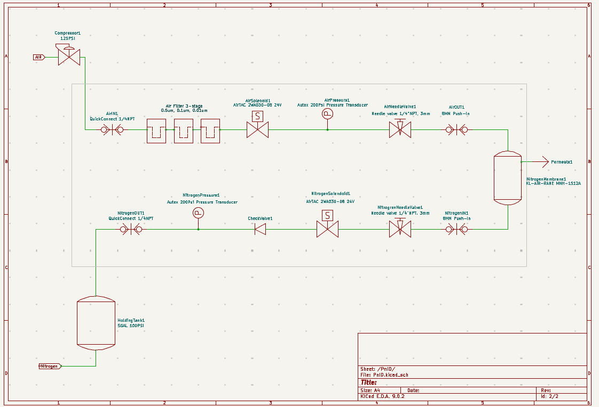

# Nitrogen Generator for Home Brewing

> **Extract 99.5%+ pure nitrogen from air for less than half the cost of commercial solutions**

A DIY membrane-based nitrogen generator that produces 50L/h (2CFH) of high-purity nitrogen at 100 PSI for serving non-carbonated beverages like cold brew coffee. Built for home brewers who want professional nitrogen service without the ongoing cost of N2 cylinders.

[](./images/final_inside.jpg)

## 🎯 Key Specifications

| Specification | Value |
|---------------|-------|
| **Nitrogen Output** | 50L/h (2 CFH) at 100 PSI |
| **Nitrogen Purity** | 99.5%+ (≤0.5% oxygen) |
| **Air Input Required** | 30L/h (1 CFM) max |
| **System Pressure** | 75-100 PSI operating range |
| **Power Requirements** | 120V/240V household power |
| **Total Build Cost** | ~$2,200 (vs $4,500+ commercial) |

## 📋 Table of Contents

- [Quick Start](#-quick-start)
- [Why Build This?](#-why-build-this)
- [How It Works](#-how-it-works)
- [Bill of Materials](#-bill-of-materials)
- [Safety Requirements](#️-safety-requirements)
- [Build Guide](#-build-guide)
- [System Design](#-system-design)
- [Component Selection Guide](#-component-selection-guide)
- [Setup & Calibration](#️-setup--calibration)
- [Troubleshooting](#-troubleshooting)

## 🚀 Quick Start

### Prerequisites
- Experience with pressurized systems (kegging knowledge helpful)
- Basic electronics/PLC programming skills
- Familiarity with compressed air fittings and NPT connections
- Safety equipment and proper workspace

### Cost Breakdown
| Category | Cost Range |
|----------|------------|
| Nitrogen membrane | $400-800 |
| Air filtration | $200-300 |
| Controller & sensors | $200-400 |
| Valves & fittings | $300-500 |
| Enclosure & misc | $200-600 |
| **Total** | **$1,300-2,600** |

### What You'll Need
- 3-4 weekends for assembly and testing
- Basic workshop with compressed air access
- Oxygen analyzer for calibration
- Multimeter and basic tools

## 💡 Why Build This?

### The Problem
Home brewers often want to serve non-carbonated beverages like cold brew coffee alongside their beer. While CO2 works great for beer, nitrogen provides the smooth, creamy mouthfeel these drinks require. Commercial N2 cylinders work but are expensive to refill and inconvenient.

### The Solution
Since air is 78% nitrogen, we can extract it using membrane separation technology. Commercial nitrogen generators exist but cost $4,500+ and are designed for continuous industrial use, not intermittent home brewing needs.

### Our Approach
- **Intermittent operation**: Only runs when nitrogen is needed
- **Optimized for home use**: 50L/h output fills one keg per hour
- **Cost-effective**: Half the price of commercial solutions
- **Portable**: Compact design for mobile brewing setups

## ⚙️ How It Works

### Membrane Separation Process
1. **Compressed air input**: Filtered air enters the hollow fiber membrane
2. **Selective permeation**: Oxygen and water vapor pass through membrane walls
3. **Nitrogen concentration**: Larger nitrogen molecules remain in the fiber cores
4. **Purity control**: Output needle valve fine-tunes final nitrogen concentration

### Control Logic
```
┌─────────────────────────────────────────────────────────┐
│ SYSTEM IDLE                                             │
│ • Both solenoids closed                                 │
│ • Monitoring tank pressure                              │
└─────────────────┬───────────────────────────────────────┘
                  │
                  ▼ Tank pressure < 75 PSI
┌─────────────────────────────────────────────────────────┐
│ REFILL CYCLE START                                      │
│ • Open input solenoid (10s delay for soft start)       │
│ • Wait for membrane pressure > 75 PSI                  │
└─────────────────┬───────────────────────────────────────┘
                  │
                  ▼ Membrane pressure > 75 PSI
┌─────────────────────────────────────────────────────────┐
│ NITROGEN PRODUCTION                                     │
│ • Open output solenoid                                  │
│ • Fill tank with high-purity nitrogen                  │
└─────────────────┬───────────────────────────────────────┘
                  │
                  ▼ Tank pressure ≥ 100 PSI
┌─────────────────────────────────────────────────────────┐
│ CYCLE COMPLETE                                          │
│ • Close both solenoids                                  │
│ • Return to idle state                                  │
└─────────────────────────────────────────────────────────┘
```

## 📦 Bill of Materials

### Core Components

| Component | Specification | Source | Approx. Cost |
|-----------|---------------|--------|--------------|
| **Nitrogen Membrane** | MNH-1512A (50L/h @ 100 PSI) | Alibaba (KL-AIR) | $400 |
| **3-Stage Air Filter** | 0.01μm coalescing final stage | PneumaticPlus SAFU460-N04-MEP | $200 |
| **Air Compressor** | Quiet, 1+ CFM output | Makita MAC100Q | $250 |
| **Oxygen Analyzer** | 0-30% range, flow-through | FORENSICS O2 Analyzer | $200 |
| **Holding Tank** | 5-gallon Cornelius keg | Standard homebrew supplier | $130 |

### Control System

| Component | Specification | Source | Approx. Cost |
|-----------|---------------|--------|--------------|
| **Controller** | Custom STM32 PCB or Click PLC | DIY/Automation Direct | $130-300 |
| **Pressure Sensors** | 0-200 PSI, 1/8" NPT (2x) | AUTEX Amazon | $52 |
| **Solenoid Valves** | 24V DC, normally closed (2x) | AirTAC 2WA030-08 | $80 |
| **Needle Valves** | 1/4" NPT, fine adjustment (2x) | SURUIKE INDUSTRY | $40 |

### Fittings & Misc

| Category | Description | Approx. Cost |
|----------|-------------|--------------|
| **Check Valve** | Low cracking pressure (<2 PSI) | $15 |
| **Fittings & Tubing** | NPT adapters, push-connect, tubing | $200 |
| **Enclosure** | Stainless steel or powder-coated | $200-400 |
| **Fasteners & Misc** | Mounting hardware, wire, etc. | $100 |

**Total Estimated Cost: $1,997-2,597**

## ⚠️ Safety Requirements

> **⚠️ HIGH PRESSURE SYSTEM** - Always wear safety equipment and follow proper procedures

### Critical Safety Points

| ⚠️ **MEMBRANE PROTECTION** |
|---------------------------|
| • **Never exceed 120 PSI input pressure** - Can destroy membrane instantly |
| • **Use soft-start valve** - Sudden pressure can shatter internal fibers |
| • **Monitor input pressure continuously** - Automated shutoff required |

| ⚠️ **ELECTRICAL SAFETY** |
|-------------------------|
| • **24V DC system** - Proper grounding essential |
| • **Moisture protection** - IP-rated enclosures in humid environments |
| • **Fuse protection** - All circuits properly protected |

| ⚠️ **OXYGEN DEPLETION** |
|------------------------|
| • **Adequate ventilation** - Nitrogen displaces oxygen |
| • **No confined spaces** - Test in well-ventilated areas only |
| • **Monitor O2 levels** - Use oxygen analyzer during setup |

### Required Safety Equipment
- Safety glasses and gloves
- Pressure relief valve (set to 110 PSI)
- Leak detection solution
- Multimeter for electrical testing
- Fire extinguisher rated for electrical fires

## 🔧 Build Guide

### Phase 1: Planning & Preparation

**1. Design Your Layout**
- Sketch component placement in enclosure
- Plan air flow routing and electrical connections
- Ensure easy access to adjustment valves
- Consider serviceability and maintenance access

**2. Workspace Setup**
- Adequate ventilation for testing
- Compressed air source (for initial testing)
- Electrical testing equipment
- Proper lighting and organization

### Phase 2: Pneumatic Assembly

**3. Install Air Filtration**
- Mount 3-stage filter in easily accessible location
- Connect input from compressor with proper fittings
- Install pressure gauge after filter
- Test for leaks at all connections

**4. Mount Nitrogen Membrane**
- Secure membrane horizontally or per manufacturer specs
- Connect filtered air input through input needle valve
- Install input pressure sensor after needle valve
- Route permeate (waste) air to exhaust

**5. Install Control Valves**
- Mount input solenoid between filter and membrane
- Install output solenoid between membrane and holding tank
- Connect output needle valve for purity adjustment
- Install output pressure sensor at holding tank

### Phase 3: Control System

**6. Electrical Assembly**
- Install controller in protected enclosure
- Wire pressure sensors to analog inputs
- Connect solenoid control outputs (24V switching)
- Install emergency stop and status indicators

**7. Programming/Configuration**
- Load control logic (PLC ladder or microcontroller code)
- Set pressure thresholds and timing parameters
- Configure safety interlocks and fault handling
- Test all inputs and outputs

### Phase 4: Testing & Calibration

**8. System Testing**
- Pressure test all pneumatic connections
- Verify electrical safety and grounding
- Test control logic with simulated inputs
- Perform end-to-end system validation

## 🔬 System Design

### Process Flow Diagram

[](./images/airschematic.png)

### Control Logic Details

#### Operating States

| State | Input Solenoid | Output Solenoid | Conditions |
|-------|----------------|-----------------|------------|
| **Idle** | Closed | Closed | Tank pressure ≥ 100 PSI |
| **Soft Start** | Open | Closed | Tank < 75 PSI, membrane building pressure |
| **Production** | Open | Open | Membrane > 75 PSI, tank < 100 PSI |
| **Fault** | Closed | Closed | Any safety condition triggered |

#### Safety Interlocks

```
Continuous Monitoring:
├── Input Pressure Range: 75-120 PSI
├── Output Pressure Range: 0-130 PSI  
├── Sensor Fault Detection: <-5 PSI or >150 PSI
├── Maximum Run Time: 120 seconds per cycle
└── Emergency Stop: Manual override
```

#### Timing Parameters

| Parameter | Value | Purpose |
|-----------|-------|---------|
| **Soft Start Delay** | 10 seconds | Gentle membrane pressurization |
| **Pressure Hysteresis** | 5 PSI | Prevent oscillation |
| **Fault Reset Time** | 30 seconds | Allow system stabilization |
| **Maximum Cycle Time** | 120 seconds | Prevent runaway conditions |

## 🛠️ Component Selection Guide

### Nitrogen Membrane Selection

| Model | Output @ 100 PSI | Air Input | Max Pressure | Cost | Notes |
|-------|------------------|-----------|--------------|------|-------|
| **MNH-1512A** ⭐ | 50L/h (2 CFH) | 30L/h | 120 PSI | $400 | Recommended for this build |
| MNH-2024A | 120L/h (4.2 CFH) | 170L/h | 120 PSI | $800 | Oversized for home use |
| Generic eBay | Variable | Unknown | Unknown | $100-300 | ⚠️ Quality/specs uncertain |

**Key Selection Criteria:**
- Target 50L/h output at 100 PSI and 99.5% purity
- Maximum input pressure rating ≥120 PSI
- Reasonable air consumption (<50L/h input)
- Verified specifications and datasheets

### Air Filtration Options

| Option | Filtration | Features | Cost | Maintenance |
|--------|------------|----------|------|-------------|
| **PneumaticPlus 3-Stage** ⭐ | 0.01μm final | Auto-drain, modular | $200 | 6-month elements |
| Parker Finite 3-Stage | 0.01μm final | Industrial grade | $500 | 12-month elements |
| Harbor Freight Basic | 5μm only | Basic protection | $50 | ⚠️ Insufficient filtration |

**Critical Requirements:**
- Final stage must be 0.01μm coalescing filter
- Automatic or manual drain capability
- Replaceable filter elements
- Pressure rating ≥150 PSI

### Controller Comparison

| Option | Complexity | Cost | Features | Programming |
|--------|------------|------|----------|-------------|
| **Custom STM32 PCB** ⭐ | Medium | $130 | Compact, LCD display | C/C++ |
| Click PLC | Low | $300 | Industrial reliability | Ladder logic |
| Arduino + Shields | High | $100 | Flexible, expandable | C/C++ |
| Raspberry Pi | High | $150 | Over-featured | Python/C++ |

### Solenoid Valve Guide

| Type | Pressure Rating | Response Time | Cost | Reliability |
|------|----------------|---------------|------|-------------|
| **Direct Acting** ⭐ | 150 PSI | <100ms | $40 | High |
| Pilot Operated | 300+ PSI | <500ms | $80 | Very High |
| Proportional | Variable | Variable | $200+ | Medium |

**Recommended Specs:**
- 24V DC operation
- Normally closed (fail-safe)
- 1/4" NPT ports
- Viton seals for air service

## ⚙️ Setup & Calibration

### Initial System Setup

**1. Pre-Assembly Checks**
```
□ All fittings properly tightened with thread sealant
□ Electrical connections secure and properly insulated  
□ Pressure relief valve installed and set to 110 PSI
□ All sensors and actuators tested individually
□ Control program loaded and basic functionality verified
```

**2. Pneumatic Testing**
```
□ Pressure test system to 120 PSI and hold for 10 minutes
□ Check for leaks using soap solution at all joints
□ Verify pressure sensors read accurately with calibrated gauge
□ Test solenoid operation at working pressure
□ Confirm check valve operation and cracking pressure
```

### Input Needle Valve Adjustment

**Objective:** Prevent membrane damage from pressure shock

**Procedure:**
1. **Setup**: Connect regulated air supply to input needle valve
2. **Initial Setting**: Close valve completely, then open 2 turns
3. **Pressure Test**: Gradually increase input pressure to 100 PSI
4. **Adjustment**: Fine-tune until sudden valve opening produces gentle flow (no "bang")
5. **Verification**: Test multiple pressure scenarios

**Target Result:** Smooth, controlled pressure rise when input solenoid opens

### Output Needle Valve Calibration

**Objective:** Achieve ≤1% oxygen content in output nitrogen

**Required Equipment:**
- Oxygen analyzer with flow-through capability
- Sample tubing with no dead volume
- Patience (this process takes time!)

**Procedure:**

**Step 1: Initial Setup**
```
1. Set output needle valve to fully closed position
2. Connect oxygen analyzer to system output with minimal dead volume
3. Start system and allow input pressure to stabilize
4. Open output valve exactly 4 turns from closed
```

**Step 2: Coarse Adjustment**
```
5. Start nitrogen production cycle
6. Monitor oxygen analyzer (may read ambient 21% initially)
7. Slowly close output valve 1/4 turn at a time
8. Wait 2-3 minutes between adjustments for gas to flush
9. Continue until oxygen reading begins to drop
```

**Step 3: Fine Tuning**
```
10. When oxygen drops below 10%, slow adjustment pace
11. Make 1/8 turn or smaller adjustments
12. Wait 5+ minutes between changes
13. Target: ≤1% oxygen (99%+ nitrogen purity)
14. Mark final valve position for reference
```

**Step 4: Verification**
```
15. Run multiple production cycles
16. Verify consistent oxygen readings
17. Test flow rate (should feel minimal but present)
18. Document final settings for future reference
```

**⚠️ Critical Notes:**
- Closing valve too far reduces efficiency dramatically
- Very little flow is normal at high purity (50L/h = barely perceptible)
- Patience is essential - gas takes time to flush analyzer chamber
- Mark valve position before major adjustments

### Performance Validation

**Flow Rate Testing**
- Use flow meter or timed displacement method
- Target: 45-55L/h at 100 PSI output pressure
- Document actual performance vs. specifications

**Efficiency Monitoring**
- Measure air consumption vs. nitrogen output
- Calculate air-to-nitrogen ratio (target: 4:1 to 6:1)
- Monitor duty cycle during normal operation

**Purity Verification**
- Regular oxygen analysis during operation
- Verify purity remains stable over extended runs
- Check for purity degradation over time

## 🔍 Troubleshooting

### Common Issues

| Problem | Symptoms | Likely Causes | Solutions |
|---------|----------|---------------|-----------|
| **No Nitrogen Output** | Zero flow, no pressure build | • Membrane damaged<br>• Output valve closed<br>• Control logic fault | • Check valve positions<br>• Verify pressure sensors<br>• Inspect membrane for damage |
| **High Oxygen Content** | >2% O2 in output | • Output valve too open<br>• Membrane degradation<br>• Insufficient input pressure | • Close output valve gradually<br>• Check input pressure stability<br>• Replace membrane if old |
| **Low Flow Rate** | <40L/h output | • Output valve too closed<br>• Input pressure too low<br>• Membrane fouling | • Open output valve slightly<br>• Check air filter condition<br>• Verify input air quality |
| **System Won't Start** | No solenoid activation | • Control system fault<br>• Power supply issues<br>• Sensor out of range | • Check power connections<br>• Verify sensor readings<br>• Reset control system |

### Diagnostic Procedures

**Electrical Diagnostics**
```
1. Verify 24V power supply voltage and current capacity
2. Check all ground connections and electrical continuity  
3. Test pressure sensor outputs with multimeter
4. Verify solenoid coil resistance and operation
5. Review control system logs/status indicators
```

**Pneumatic Diagnostics**
```
1. Check system for air leaks with soap solution
2. Verify air filter condition and differential pressure
3. Test pressure relief valve operation
4. Confirm check valve proper operation direction
5. Inspect all tubing for kinks or restrictions
```

**Performance Diagnostics**
```
1. Monitor system pressures during complete cycle
2. Time production cycles and compare to specifications
3. Measure actual nitrogen flow rate vs. target
4. Analyze oxygen content trends over time
5. Calculate overall system efficiency
```

### Maintenance Schedule

**Weekly (During Active Use)**
- Check oxygen content and adjust if needed
- Verify system pressure readings
- Inspect for visible air leaks
- Monitor performance metrics

**Monthly**
- Drain water from air filter stages
- Check electrical connections for tightness
- Verify solenoid operation smoothness
- Review control system logs

**Quarterly**
- Replace air filter elements
- Calibrate pressure sensors
- Deep clean oxygen analyzer
- Performance verification testing

**Annually**
- Complete system pressure test
- Electrical safety inspection
- Control system backup/update
- Consider membrane replacement evaluation

### Emergency Procedures

**Overpressure Condition**
1. Immediately shut off air supply
2. Activate emergency stop if equipped
3. Allow system to depressurize safely
4. Investigate cause before restart

**Electrical Fault**
1. De-energize system at main disconnect
2. Do not attempt repairs under pressure
3. Check for ground faults or short circuits
4. Professional electrical inspection if needed

**Membrane Failure**
1. System will typically fail safe (no nitrogen output)
2. Check for unusual sounds or air leaks
3. Depressurize system completely before inspection
4. Replace membrane following manufacturer procedures

---

## 📚 Additional Resources

### Technical References
- [MNH-1512A Membrane Specifications](./docs/MNH-1512A.pdf)
- [System P&ID Diagram](./PnID.kicad_sch)
- [PCB Design Files](./NitrogenGenerator.kicad_pro)

### Supplier Links
- **Nitrogen Membranes**: Alibaba.com (KL-AIR manufacturer)
- **Air Filtration**: PneumaticPlus, Parker Hannifin
- **Control Components**: Automation Direct, McMaster-Carr
- **Oxygen Analyzers**: Amazon, scuba diving suppliers

### Community Support
- Home brewing forums for nitrogen serving discussions
- DIY automation communities for control system help
- Compressed air forums for pneumatic system guidance

---

*Built with ❤️ for the home brewing community. Share your builds and improvements!*